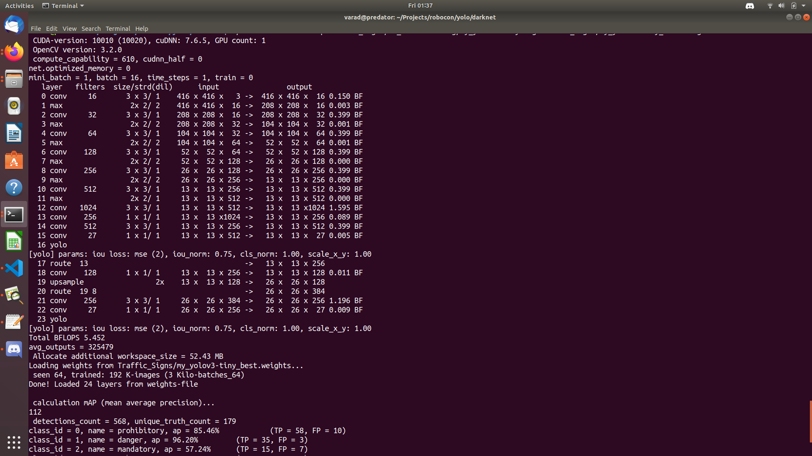
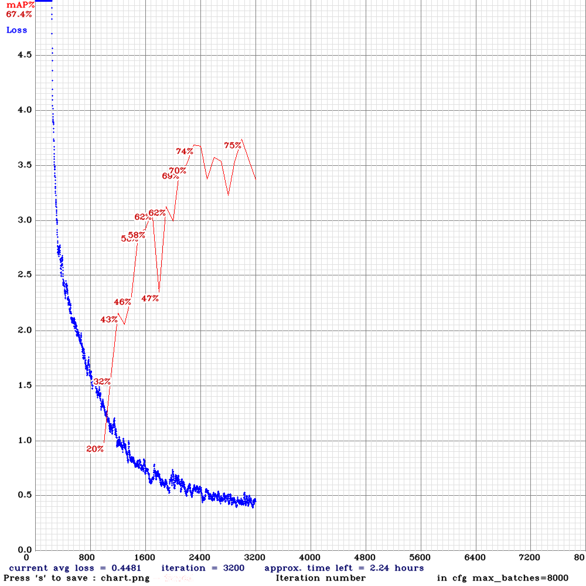
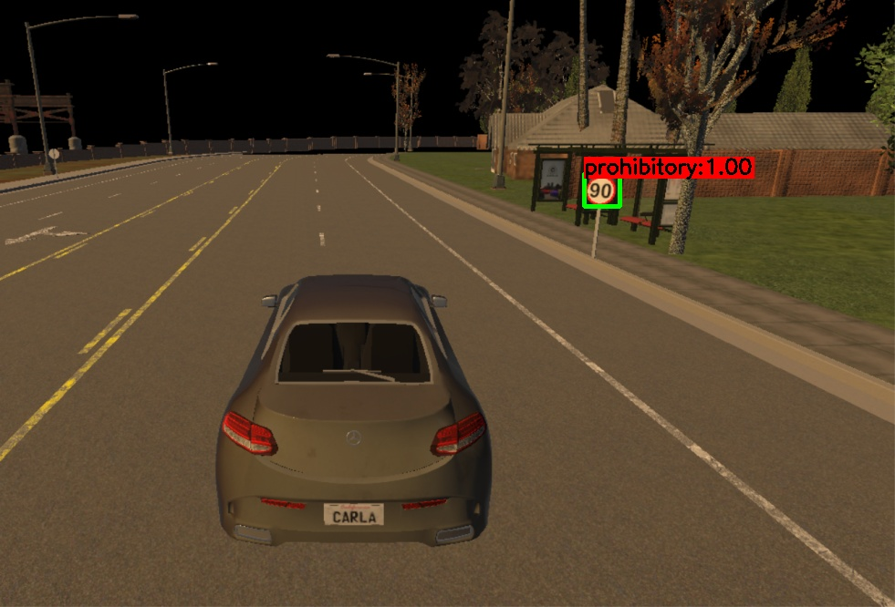

# YOLO Traffic Sign Detection 

## Installation and configuration of YOLO

Please Refer https://github.com/AlexeyAB/darknet/blob/master/README.md

## Training of Model
### About

Model was trained on 721 images categorised into 4 clases: 
* Prohibitory
* Danger
* Mandatory
* Other

### Configuration (CFG) File
#### Neural Network Model 


#### Setting up Anchors
Anchors set = 9 
Anchors were calculated using:
```
./darknet detector calc_anchors Traffic_Signs/ts_data.data -num_of_clusters 9 -width 416 -height 416
```
Initially Tried with 6 Anchors accuracy was very less, then gradually increased to 9. 

### Training Process 
Model was trained till 3200  iterations, stopped as the graph became wavy. 



## Testing Accuracy     

#### Accuracy Achieved
Maximum mean average precision (mAP@0.50) = 0.747151, or 74.72 % 
```
 ./darknet detector map Traffic_Signs/ts_data.data cfg/my_yolov3-tiny.cfg Traffic_Signs/my_yolov3-tiny_best.weights
```

#### Image or Video Testing
```
python3 yolo_check.py --video=run.mp4
python3 yolo_check.py --image=bird.jpg
```

#### Testing on Carla Simulator

Image Output


Video Output
[](abc_yolo_out.mp4)

